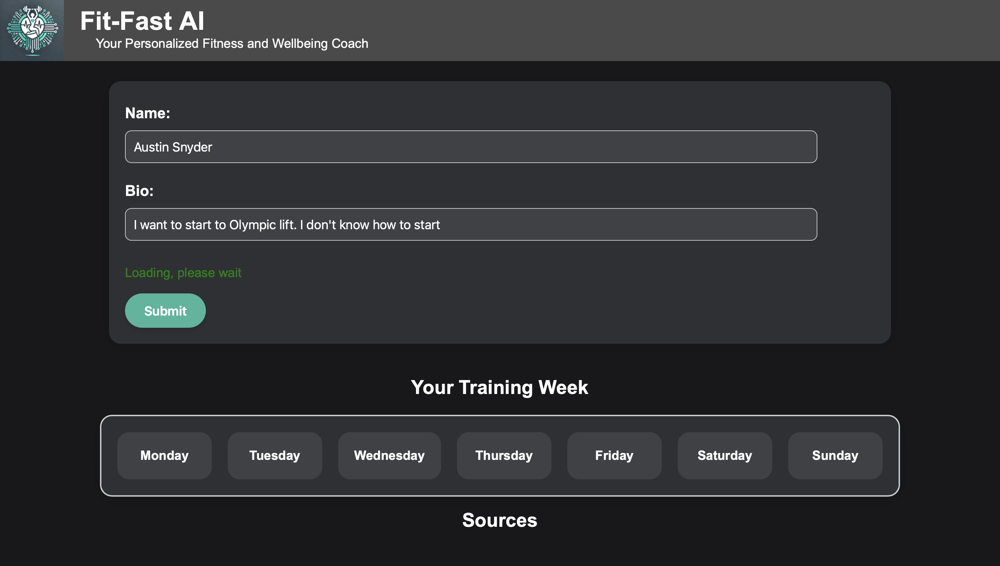

# FitFastAI: Your Personalized Fitness and Wellbeing Coach


WIP UI:

## Overview

FitFastAI is an innovative application that leverages the power of artificial intelligence to create personalized health regimens and exercise plans tailored to each user's unique needs and goals. By combining perplexity-based information sourcing with generative AI for content creation, we offer a cutting-edge solution for health-conscious individuals seeking customized guidance to improve their health and wellbeing.

## .env file

The .env file is used to store the API keys for the Perplexity and OpenAI APIs. It is not included in the repository due to the sensitivity of the API keys.

```.env
OPENAI_API_KEY=<KEY HERE>
PERPLEXITY_API_KEY=<KEY HERE>
```

## Key Features

1. **Personalized Exercise Plans**: AI-generated workout routines based on user preferences, fitness level, and goals.
2. **Nutritional Guidance**: Custom meal suggestions and dietary advice powered by perplexity-sourced nutritional information.
3. **Progress Tracking**: Easy-to-use interface for logging workouts and monitoring health metrics.
4. **AI Health Coach**: Virtual assistant providing motivation, tips, and answering health-related questions.
5. **Integration with Wearables**: Sync with popular fitness trackers for more accurate data collection.

## How It Works

1. User inputs personal information, goals, and preferences.
2. Our AI analyzes the data and sources relevant health information using perplexity.
3. Generative AI creates a tailored health regimen and exercise plan.
4. Users can interact with the AI coach for ongoing support and plan adjustments.
5. Regular updates based on user feedback and progress data ensure continual optimization.

*Full functionality is not yet fully implemented.*

## Benefits

- Customized plans that adapt to your progress and changing needs
- 24/7 access to AI-powered health advice
- Evidence-based recommendations sourced from reputable health databases
- Motivational support to help you stay on track
- Privacy-focused design with secure data handling

## Get Started

Experience the future of personalized health and fitness. Sign up for FitFastAI today and take the first step towards a healthier, more active lifestyle!

The backend is built using Flask and has a requirements.txt file for required dependencies.

*Note: This is a minimal viable product (MVP) demonstration. Full functionality is under development.*

## Project Contributors

This project is being built by a team of two students from Central Washington University. See our profiles below:

- [Austin Snyder](https://github.com/AustinSnyd3r)
- [Alice Williams](https://github.com/AvaAvarai)

*Built overnight at the 2024 DubHacks Hackathon, the largest hackathon in the Pacific Northwest.*

## License

FitFastAI is freely released under the open-source MIT License. Please see the [LICENSE](LICENSE) file for further details.
